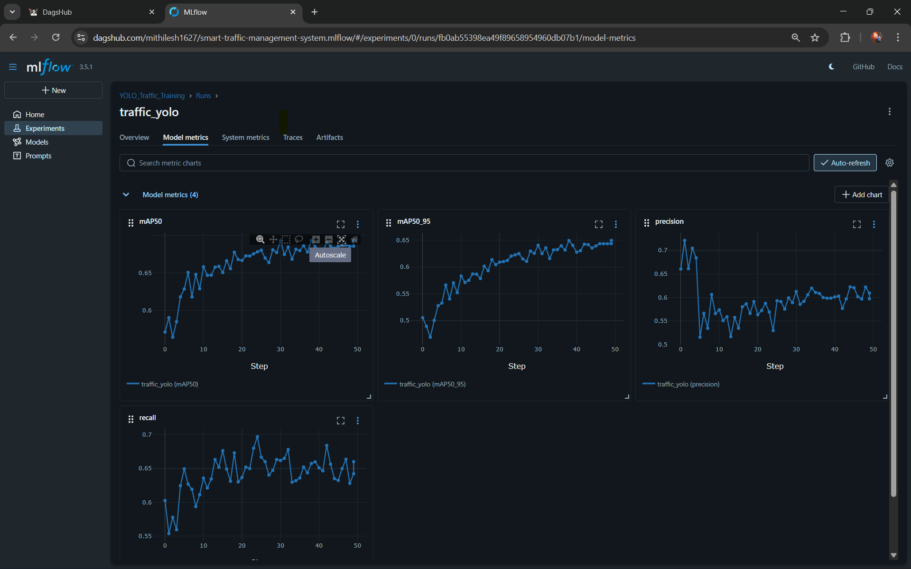
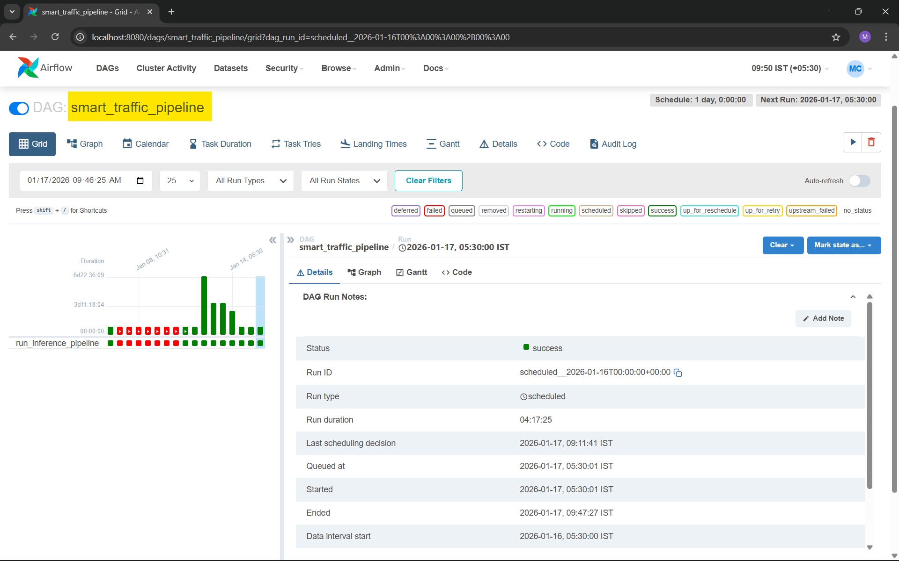
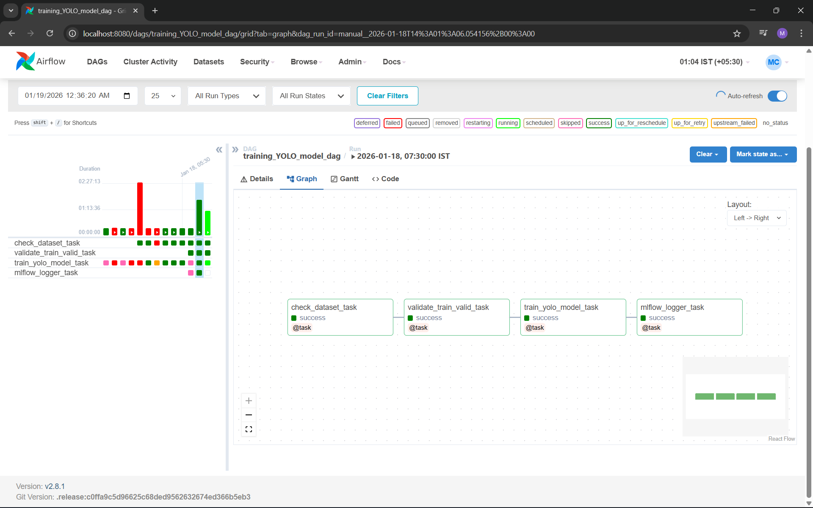
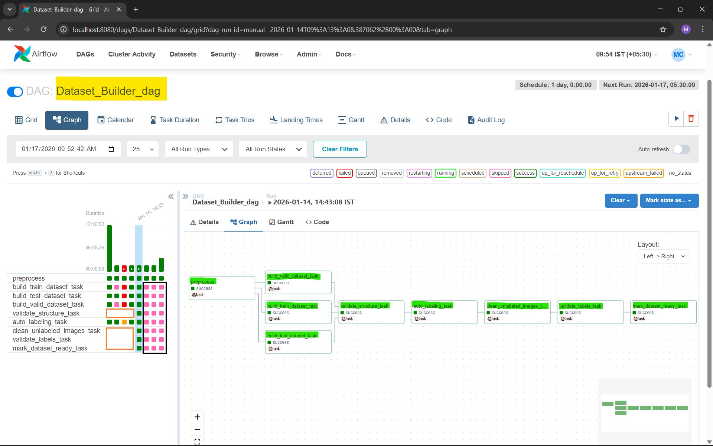
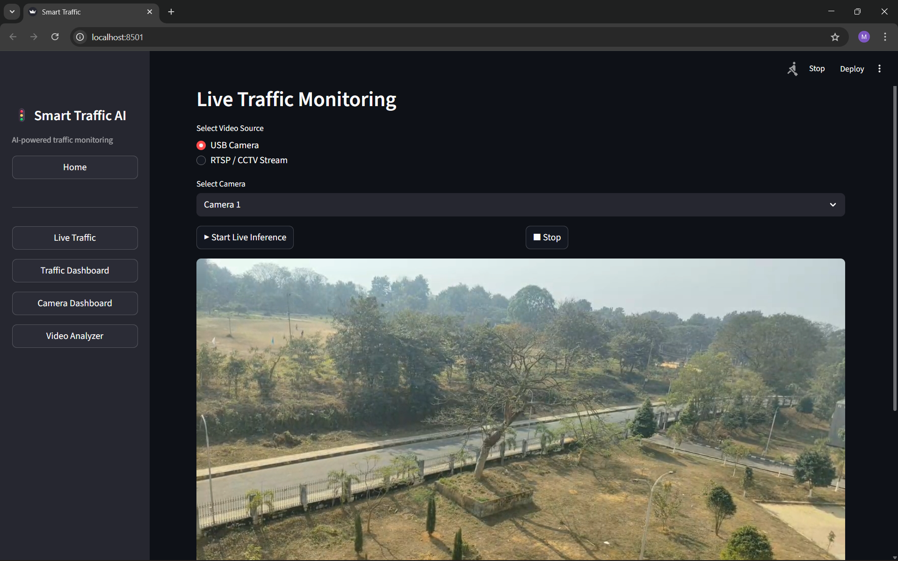

#  Smart Traffic Management System
---
**End-to-End Computer Vision + MLOps Pipeline using YOLO, Airflow, MLflow & DVC**

This project implements a production-grade **Smart Traffic Management System** that processes traffic videos to detect, track, and analyze vehicles. The system is fully automated using **Apache Airflow**, supports **dataset versioning with DVC**, and tracks experiments using **MLflow**.


## 🎯 Problem Statement & Motivation

Urban traffic monitoring systems often rely on manual analysis or fragmented tools,
making it difficult to derive real-time insights such as vehicle density, flow,
and congestion patterns.

This project aims to build a **scalable, automated, and reproducible traffic analytics system**
that:
- Converts raw traffic videos into structured insights
- Automates training and inference using MLOps best practices
- Enables rapid experimentation and deployment of CV models


## ✨ Key Features

| Feature | Description |
|------|-----------|
| 🚗 Vehicle Detection | YOLO-based real-time object detection |
| 🎯 Object Tracking | Persistent ID tracking across frames |
| 📈 Traffic Metrics | Vehicle count, flow, density estimation |
| 🧪 Dataset Validation | Integrity checks & auto-labeling |
| 🔁 Experiment Tracking | MLflow logging & reproducibility |
| 📊 Visualization | Streamlit dashboards |


## 🧰 Tech Stack

| Layer | Tools |
|-----|------|
| Computer Vision | YOLO (Ultralytics), OpenCV |
| Deep Learning | PyTorch |
| Workflow Orchestration | Apache Airflow |
| Experiment Tracking | MLflow |
| Dataset Versioning | DVC |
| Database | MongoDB |
| Visualization | Streamlit, Plotly |
| Language | Python 


## 📊 Model Performance (Detection)

The YOLO-based object detection model was trained on the **India Driving Dataset (IDD)** and evaluated on the validation split.  
All metrics are automatically logged and tracked using **MLflow**.

### 📈 Evaluation Metrics

| Metric | Value |
|------|------|
| mAP@0.5 | 0.0 |
| mAP@0.5:0.95 | 0.0 |
| Precision | 0.0 |
| Recall | 0.0 |
| Box Loss | 0.0 |
| Class Loss | 0.0 |
| DFL Loss | 0.0 |

> ⚠️ Metrics may vary depending on dataset version, image resolution, and training configuration.


### 🧪 MLflow Experiment Tracking

All training runs are tracked using MLflow, including:

- Epoch-wise training & validation metrics
- Loss curves
- Hyperparameters
- Dataset version hash (DVC)
- Model artifacts

<p align="center">
  
</p>

<p align="center">
  <em>MLflow dashboard showing YOLO training metrics and loss curves</em>
</p>


### 🏆 Best Model Selection

The best-performing model is selected based on:

- Highest **mAP@0.5**
- Stable validation loss
- Consistent precision–recall tradeoff

Only models that pass performance validation are:

- Registered in **MLflow Model Registry**
- Promoted to **Production**
- Used by the inference pipeline


This ensures:

```text
Dataset Version → Model Version → Inference Output
```

## 📁 Project Structure
>  **Repository Overview**  
> This repository follows a **production-ready, modular layout** inspired by
> real-world ML systems.

```text
smart-traffic-management-system/        # End-to-end Smart Traffic Management (CV + MLOps)

├── airflow/                            # Airflow orchestration layer (pipelines & DAGs)
│   └── dags/                           # Airflow DAG definitions
│       ├── data_preprocessing_dag.py   # Dataset preprocessing & validation DAG
│       ├── smart_traffic_pipeline.py   # End-to-end traffic ML pipeline DAG
│       ├── train_yolo_dag.py            # YOLO training DAG (GPU-enabled)
│       ├── __init__.py
│       └── individual_dags/             # Split-wise dataset DAGs
│           ├── test_dataset_dags.py     # Test dataset pipeline
│           ├── train_dataset_dags.py    # Train dataset pipeline
│           └── valid_dataset_dags.py    # Validation dataset pipeline
│
├── data_processing/                    # Dataset utilities & experiments (offline scripts)
│   ├── rename_dataset_images.py        # Normalize dataset image names
│   ├── test_auto_labeling.py           # Auto-labeling for test split
│   ├── test_image_dataset.py           # Dataset sanity checks (test)
│   ├── train_auto_labeling.py          # Auto-labeling for train split
│   ├── train_image_dataset.py          # Train dataset preparation
│   ├── valid_auto_labeling.py          # Auto-labeling for validation split
│   ├── valid_image_dataset.py          # Validation dataset preparation
│   ├── verify_yolo_bboxes.py           # YOLO bounding-box visualization
│   └── __init__.py
│
├── docker/                             # Dockerization for services
│   ├── airflow/                       # Airflow container setup
│   │   └── Dockerfile
│   ├── inference/                     # Inference service container
│   │   └── Dockerfile
│   └── streamlit/                     # Streamlit dashboard container
│       └── Dockerfile
│
├── IDD_Dataset/                       # IDD dataset (DVC-tracked, large files ignored)
│   ├── Processed_dataset/             # Cleaned & split dataset
│   │   ├── train/                     # Training split
│   │   │   ├── images/                # Train images
│   │   │   └── label/                 # Train labels (YOLO format)
│   │   ├── test/                      # Test split
│   │   │   ├── images/
│   │   │   └── label/
│   │   └── valid/                     # Validation split
│   │       ├── images/
│   │       └── label/
│   ├── data.yaml                      # YOLO dataset config
│   ├── train.txt                      # Train image paths
│   ├── test.txt                       # Test image paths
│   └── val.txt                        # Validation image paths
│
├── inference/                         # Inference pipeline (runtime execution)
│   ├── pipeline.py                    # CLI-based inference pipeline
│   ├── pipeline_without_cmd.py        # Programmatic inference pipeline
│   └── __init__.py
│
├── mlruns/                            # MLflow experiment tracking (auto-generated)
│
├── notebook/                          # Research & experimentation notebooks
│   ├── auto_label.ipynb               # Auto-labeling experiments
│   ├── data_analysis.ipynb            # Dataset analysis
│   ├── test_split.py                  # Dataset split testing
│   └── yolo11n.pt                     # Pretrained YOLO weights
│
├── pipelines/                         # Core ML pipeline logic (used by Airflow)
│   ├── dataset_cleaner.py             # Remove corrupt/unlabeled images
│   ├── dataset_labeling.py            # YOLO-based auto labeling
│   ├── dataset_validator.py           # Dataset integrity validation
│   ├── mark_dataset_ready.py          # Dataset readiness (.done marker)
│   ├── mlflow_dedup.py                # Training deduplication logic
│   ├── mlflow_dvc_logger.py           # DVC + MLflow logging
│   ├── mlflow_yolo_logger.py          # YOLO model MLflow logging
│   ├── test_dataset_builder.py        # Test dataset builder
│   ├── training_fingerprint.py        # Unique training signature
│   ├── training_params.py             # Centralized training parameters
│   ├── train_dataset_builder.py       # Train dataset builder
│   ├── valid_dataset_builder.py       # Validation dataset builder
│   ├── yolo_training.py               # YOLO training logic
│   └── __init__.py
│
├── streamlit_app/                     # Interactive Streamlit dashboard
│   ├── app.py                         # Streamlit app entry point
│   ├── components/                   # Reusable UI components
│   │   ├── camera_utils.py
│   │   ├── charts.py
│   │   ├── config_streamlit.py
│   │   ├── mlflow_reader.py
│   │   ├── mongo_reader.py
│   │   ├── run_job.py
│   │   ├── upload_handler.py
│   │   ├── video.py
│   │   └── __init__.py
│   ├── views/                        # Dashboard pages
│   │   ├── camera_dashboard.py
│   │   ├── dashboard.py
│   │   ├── home.py
│   │   ├── live_traffic.py
│   │   ├── video_analyzer.py
│   │   └── __init__.py
│   └── __init__.py
│
├── traffic_metrics/                  # Domain-specific traffic analytics
│   ├── density.py                    # Traffic density estimation
│   ├── flow.py                       # Vehicle flow calculation
│   ├── traffic_engine.py             # Core traffic logic engine
│   ├── vehicle_count.py              # Vehicle counting logic
│   └── __init__.py
│
├── user_upload_data/                 # User-uploaded inference data
│   ├── outputs/                      # Inference outputs
│   └── uploads/                      # Uploaded videos
│
├── utils/                            # Shared utilities & helpers
│   ├── airflow_config.py             # Global Airflow configs
│   ├── config.py                     # Global project configs
│   ├── insert_fake_data.py           # Test data insertion
│   ├── metrics_aggregator.py         # Metric aggregation
│   ├── mlflow_tracker.py             # MLflow helpers
│   ├── mongo.py                      # MongoDB connection
│   ├── mongo_writer.py               # MongoDB writers
│   ├── tracker_adapter.py            # Tracker abstraction
│   ├── video_reader.py               # Video input utilities
│   ├── yolo_tracker.py               # YOLO inference wrapper
│   └── __init__.py
│
├── visualization/                    # Visualization helpers
│   ├── draw_utils.py                 # Bounding box rendering
│   ├── video_writer.py               # Output video writer
│   └── __init__.py
│
├── docker-compose.yml                # Multi-container orchestration
├── requirements.txt                  # Python dependencies
├── README.md                         # Project documentation
└── LICENSE                           # License

```


## 🏗️ System Architecture

The Smart Traffic Management System follows a layered, production-grade MLOps architecture
covering **data ingestion → training → inference → analytics**, orchestrated via Apache Airflow.

<p align="center">
  
</p>

<p align="center">
  <em>End-to-end Computer Vision + MLOps architecture using YOLO, Airflow, MLflow & DVC</em>
</p>

### 🏗️ Architecture Flow Summary

1. **Data Ingestion**  
   Raw traffic videos are collected from cameras or user uploads.

2. **Data Processing**  
   Videos are preprocessed and validated to ensure label integrity and data quality.

3. **Dataset Versioning (DVC)**  
   Clean datasets are versioned and reproducible across experiments.

4. **Model Training (YOLO)**  
   YOLO models are trained using Airflow-managed pipelines with full experiment tracking in MLflow.

5. **Model Registry**  
   Trained models are stored and promoted for inference.

6. **Inference Pipeline**  
   Videos are processed using the trained model, followed by object tracking and traffic analytics.

7. **Storage & Visualization**  
   Metrics are stored in MongoDB / CSV and visualized via a Streamlit dashboard.


## 🧠 Airflow DAG Design

The system is orchestrated using Apache Airflow with modular DAGs:

| DAG Name | Responsibility |
|--------|----------------|
| data_preprocessing_dag | Dataset cleaning, validation, Split-wise dataset processing and auto-labeling |
| train_yolo_dag | YOLO training with MLflow & DVC integration |
| traffic_inference_analytics_dag |  data → inference |

Each DAG is designed to be:
- Idempotent
- Retry-safe
- Independently triggerable


##  Airflow DAG Orchestration

Apache Airflow is used to orchestrate the complete ML lifecycle — from dataset validation
to model training and inference — ensuring reproducibility and automation.

###  End-to-End Smart Traffic Pipeline DAG

<p align="center">
  
</p>

<p align="center">
  <em>Master DAG coordinating preprocessing, training, inference, and monitoring</em>
</p>


###  YOLO Training DAG

<p align="center">
  
</p>

<p align="center">
  <em>Automated YOLO training with dataset validation, DVC versioning, and MLflow tracking</em>
</p>


###  Dataset Preprocessing & Validation DAG

<p align="center">
  
</p>

<p align="center">
  <em>Ensures dataset integrity before training or inference</em>
</p>

---
## 📊 Streamlit Dashboard

The system includes an interactive **Streamlit dashboard** for monitoring traffic analytics,
model performance, and inference outputs in real time.

###  Home Dashboard

<p align="center">
  
</p>

<p align="center">
  <em>Central control panel for traffic monitoring and job execution</em>
</p>

---

###  Live Traffic Analysis

<p align="center">
  
</p>

<p align="center">
  <em>Real-time vehicle detection, tracking, and traffic density visualization</em>
</p>

---

###  Analytics & Metrics Dashboard

<p align="center">
  
</p>

<p align="center">
  <em>Historical metrics, flow analysis, and ML experiment insights</em>
</p>

---

## 📦 Dataset Information

This project uses the India Driving Dataset (IDD) ~22.8GB for training and evaluation of traffic
object detection models.

 Dataset Details

> Name: IDD Detection (22.8 GB)

> Domain: Road scene understanding (Indian traffic conditions)

> Content: Images captured from Indian roads

> Annotations: Vehicle classes, road objects, and scene elements

> Use Case: Vehicle detection, traffic analysis, and urban mobility research

Dataset Credits
``` text 
    > Authors: International Institution of Information Technology, Hyderabad (India) (IIIT Hyderabad)
    > Dataset Details : https://idd.insaan.iiit.ac.in/dataset/details/
    > Official Website: https://idd.insaan.iiit.ac.in/
```
### 🧠 Why IDD?
```text 
> Indian traffic presents unique challenges:
> Mixed traffic (cars, bikes, buses, pedestrians)
> Non-lane-based driving
> Dense urban scenes

Using IDD ensures the model learns real-world complexity, making the system more robust
than models trained on synthetic or western datasets.
```
## 📦 Dataset Versioning with DVC

This project uses **DVC (Data Version Control)** to manage large-scale datasets and ensure full reproducibility across training and inference pipelines.

The dataset (~22GB) is **not stored in Git**, but versioned externally using DVC with a remote backend (DagHub / Cloud Storage).


### 🎯 Why DVC?

In real-world ML systems, models are highly sensitive to data changes.  
DVC enables:

    - Version control for large datasets  
    - Reproducible ML experiments  
    - Data lineage tracking  
    - Safe collaboration without pushing datasets to Git  


### 🧬 Dataset Versioning Strategy

Each dataset version is uniquely identified by a **content-based hash** generated by DVC.

**Dataset structure:**

```text
IDD_Dataset/
├── Processed_dataset/
│   ├── train/
│   ├── valid/
│   └── test/
└── data.yaml
```
#### When dataset contents change (images, labels, or splits):

    > DVC generates a new dataset hash
    > Previous versions remain reproducible
    > Model retraining becomes fully traceable


### 🔗 Dataset Hash Example

Check dataset status using:
```bash
    dvc status
```
Example output:
```bash
  Data and pipelines are up to date.
  dataset.dvc (md5): 9f3a2c7e4b8d2f91a4c6e3f9a0b1c2d3
```

This hash uniquely represents:

    → Image files
    → Label files
    → Train / validation / test splits

### 🔁 Integration with MLflow

During training, the dataset version hash is automatically logged to MLflow:
```bash
dvc_dataset_hash = 9f3a2c7e4b8d2f91a4c6e3f9a0b1c2d3
```

This enables complete end-to-end traceability:

    Dataset Version → MLflow Run → Model Version


### ⚙️ Airflow + DVC Integration

Apache Airflow orchestrates dataset preparation and versioning:

    Dataset validation
    YOLO-based auto-labeling
    Train / valid / test split verification
    DVC tracking (dvc add)
    Dataset push to remote storage

Only validated datasets are allowed to proceed to training.


### 🧠 Training Deduplication

Before starting training, Airflow computes a training fingerprint based on:

    Dataset hash (DVC)
    Training hyperparameters
    Model architecture
    Image resolution
    
If the same fingerprint already exists in MLflow:

    ✔ Training is automatically skipped (pink colour box are skipped task by airflow in training dag Screenshot Image) 
    ✔ GPU resources are saved
    ✔ Duplicate models are avoided
    
This ensures efficient, cost-aware ML pipelines.

### ♻️ Reproducibility Guarantee

Any previous experiment can be fully reproduced using:
```bash 
git checkout <commit>
dvc pull
```

Resulting in:

    Identical dataset
    Identical training configuration
    Identical model behavior
    

## 📊 Experiment Tracking with MLflow

This project uses **MLflow** to track, compare, and reproduce all YOLO training experiments. MLflow acts as the **central experiment registry**, capturing every detail required to
understand **how a model was trained, on which data, and with what configuration**.

### 🎯 Why MLflow?

In real-world ML systems, multiple experiments are run with different:

    - Hyperparameters
    - Dataset versions
    - Image resolutions
    - Model architectures
    - Augmentation strategies

MLflow enables:

    - Centralized experiment tracking  
    - Easy comparison between training runs  
    - Full reproducibility  
    - Model version control  
    - Seamless integration with Airflow and DVC  


### 🧪 What is Tracked?

For every YOLO training run, MLflow automatically logs:

  #### 🔧 Parameters
  - Model type (YOLO variant)
- Image size
- Batch size
- Epochs
- Learning rate
- Optimizer
- Augmentation flags

#### 📈 Metrics
- mAP@0.5
- mAP@0.5:0.95
- Precision
- Recall
- Training loss
- Validation loss

#### 📦 Artifacts
- Trained YOLO weights
- Model configuration files
- Training plots
- Evaluation results

#### 🧬 Dataset Metadata
- **DVC dataset hash**
- Train / validation / test split info


### 🔁 MLflow Run Structure

Each training execution creates a structured MLflow run:

```text
Experiment: YOLO_Traffic_Training
└── Run
    ├── Params
    │   ├── epochs = 50
    │   ├── imgsz = 640
    │   ├── batch = 16
    │   └── model = yolov8n.pt
    │
    ├── Metrics
    │   ├── map50
    │   ├── map5095
    │   ├── precision
    │   └── recall
    │
    ├── Tags
    │   ├── dataset_hash
    │   ├── training_signature
    │   └── model_version
    │
    └── Artifacts
        ├── weights/
        ├── results.png
        └── confusion_matrix.png
```
### 🧬 Dataset ↔ Model Traceability
Each MLflow run stores the exact dataset version hash used for training:

```text
Copy code
dataset_hash = 9f3a2c7e4b8d2f91a4c6e3f9a0b1c2d3
```

### 🧠 Training Deduplication Logic
Before triggering training, Airflow checks MLflow for an existing run with the same:

Dataset hash (DVC)

    Hyperparameters
    Model architecture
    Image resolution

A training signature is generated.

If the same signature already exists in MLflow:

    ✔ Training is automatically skipped

    ✔ Duplicate experiments are avoided

    ✔ GPU cost is reduced


#### ♻️ Reproducibility Guarantee

Any past experiment can be reproduced exactly using:
```bash
git checkout <commit>
dvc pull
mlflow run .
```

Resulting in:

    > Same dataset
    > Same parameters
    > Same trained model
    
---

##  Setup & Installation

This section explains how to set up the Smart Traffic Management System locally for **training, inference, and visualization**.

### 1) Prerequisites

Ensure the following are installed:

- Python ≥ 3.9  
- Git  
- DVC (for dataset versioning)  
- MongoDB (local or remote)  
- Apache Airflow  
- (Optional) CUDA + GPU for faster YOLO training  

### 2) Clone the Repository

```bash
git clone https://github.com/mithilesh1627/smart-traffic-management-system.git
cd smart-traffic-management-system
```

### 3) Create & Activate Virtual Environment
  ##### a) Linux / macOS / WSL
  ``` bash
      python3 -m venv venv
      source venv/bin/activate
   ```
  ##### b) Windows (PowerShell)
  ```bash
    python -m venv venv
    venv\Scripts\activate
  ```
### 4) Install Dependencies
  ```bash
  pip install --upgrade pip
  pip install -r requirements.txt
  ```
### 5) Dataset Setup (DVC)
 This project uses DVC to manage large datasets.
```bash
dvc pull
```
Ensure your DVC remote is configured before running this command.

### 6) Configure Environment Variables

Create a .env file in the project root:
``` env 
# MongoDB
MONGO_URI=mongodb://localhost:27017
MONGO_DB=traffic_db

# MLflow
MLFLOW_TRACKING_URI=sqlite:///mlflow.db

# Paths
DATA_ROOT=IDD_Dataset
MODEL_ROOT=models
```
### 7) Airflow Setup

Initialize Airflow metadata database:
``` bash
airflow db init
```

Start Airflow services:
```bash
airflow webserver --port 8080
airflow scheduler
```
Open Airflow UI:
  > http://localhost:8080

### 8) Run Training Pipeline

Trigger the YOLO training pipeline from the Airflow UI:
``` sql
DAGs → train_yolo_dag → Trigger
```

This pipeline performs:

      Dataset validation
      
      DVC versioning

      YOLO training

      MLflow experiment tracking
      
### 9) Run Inference Pipeline

Run inference on a video file:
```bash
python inference/pipeline.py --source /path/to/video.mp4
```

Outputs:

    Tracked video
    Traffic metrics
    MongoDB / CSV records
    
###  10) Launch Streamlit Dashboard (Optional)
```bash
cd streamlit_app
streamlit run app.py
```
Open in browser:
>  http://localhost:8501

## 🚀 Future Enhancements

- Multi-camera tracking  
- Detect whether the driver is wearing a helmet and notify administrators via IoT (Raspberry Pi)  
- Vehicle re-identification  
- Number plate recognition  
- Detection of traffic rule violations  
- Real-time Kafka-based data ingestion  

<hr/>

<p align="center">
  Built with  by <b>Mithilesh Chaurasiya</b>  
  <br/>
  NIT-Agartala
  2026
</p>
